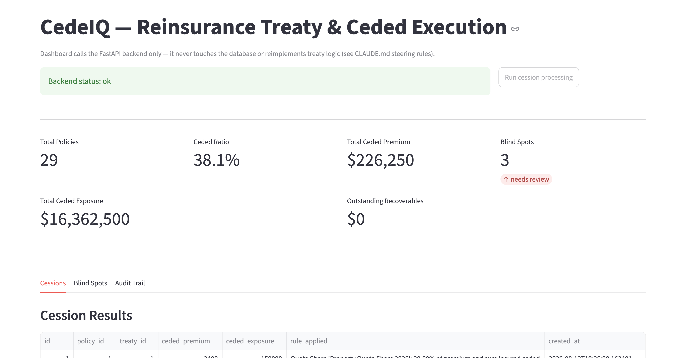
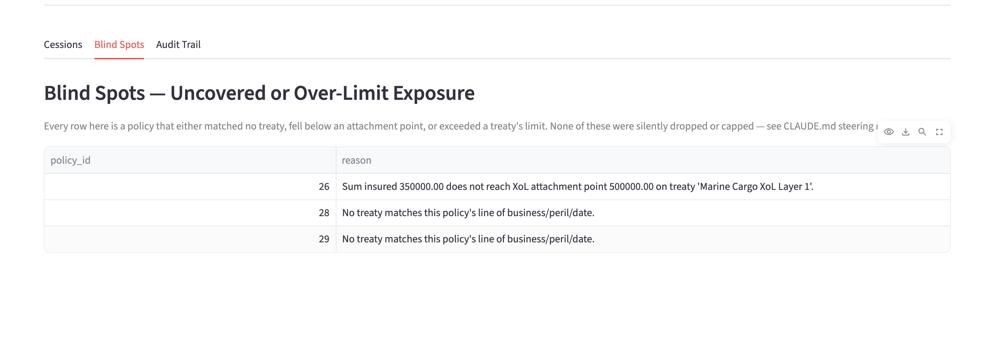

# Daily Activity Log — CedeIQ Capstone

Fill one entry per day. Required fields per QS AI Practitioner+ guidelines:
Tool used | Feature explored | Prompt examples | Output generated | Learnings | Issues faced

## Day 1 — 13-Aug-2026

Note: due to a compressed timeline (no CLI Claude Code budget available — see
"Issues faced"), this single day covers ground that would normally span
several program sessions: Project Info Files, Plan Mode concepts, Spec-Driven
Development, Steering, and initial rules-engine implementation.

**Tool used:** Claude (chat interface, with file-creation tools) instead of
the Claude Code CLI, due to no available Pro/Max subscription or API credit
budget for this capstone.

**Feature explored:**
- Project Info Files — wrote `CLAUDE.md` (project context, domain glossary,
  steering rules) as the single source of truth for the project.
- Spec-Driven Development — wrote `specs/mvp-spec.md` with user stories,
  data model, and API endpoint definitions before writing any code.
- Steering — defined explicit rules in `CLAUDE.md` §6 (e.g. "never silently
  cap a cession that exceeds a treaty limit — flag it instead"), then
  verified the rules engine actually follows them.

**Prompt examples:**
- "Read the QS AI Practitioner+ PDF and identify all prerequisites needed to
  make this capstone MVP-ready."
- "Build the SQLAlchemy models for Treaty, Policy, Cession, AuditLog, and
  Recoverable based on specs/mvp-spec.md §4."
- "Implement a rules engine that matches policies to Quota Share and Excess
  of Loss treaties, calculates cessions, and flags blind spots without
  silently capping exceeded limits."

**Output generated:**
- `CLAUDE.md`, `specs/mvp-spec.md`, `docs/daily-log.md` (this file)
- Backend: 5 SQLAlchemy models, Pydantic schemas, rules engine
  (`services/rules_engine.py`), 5 FastAPI routers, `main.py` wiring
- `seed_data.py` — synthetic treaty/policy data with deliberate blind-spot
  and limit-breach scenarios for demoing the rules engine
- Verified locally: `POST /cessions/run` correctly ceded matching policies
  and flagged blind spots per the seeded scenarios
- Git repo initialized and pushed to GitHub with real commit history

**Learnings:**
- FastAPI's `/docs` page (Swagger UI) is generated automatically from route
  type hints and Pydantic schemas — no separate documentation step needed.
  This is why schemas.py exists as strongly-typed classes rather than raw
  dicts: validation, docs, and type safety all come from the same source.
- Encoding steering rules explicitly in `CLAUDE.md` (e.g. "never silently
  cap") turned into a concrete, testable behavior in the rules engine
  (`apply_excess_of_loss` returns a flagged remainder rather than truncating)
  — this made the abstract idea of "governance" tangible.
- Keeping the rules engine pure (no DB calls inside `rules_engine.py`) made
  it straightforward to reason about and will make it easy to unit test.

**Issues faced:**
- Anthropic's $5 new-account API credit, expected to fund a few short Claude
  Code CLI sessions for Plan Mode / Subagents / Hooks / MCP demonstration,
  was not available/was already exhausted, and a Pro subscription ($20/mo)
  wasn't reimbursable for this internal capstone. Resolution: built the
  application logic entirely via the chat interface (still Claude, still
  file-creation tooling) and will document Plan Mode, Subagents, Hooks, and
  MCP as designed-and-configured (see `.claude/agents/` and
  `.claude/settings.json`) rather than executed live in a paid terminal.

## Day 2 — 14-Aug-2026

**Tool used:** Claude (chat interface, with file-creation tools) — same
constraint as Day 1, no Claude Code CLI budget available.

**Feature explored:**
- Testing discipline as a form of Skills/reusable practice — wrote a pytest
  suite that exercises the rules engine directly, without a database, by
  keeping the engine's functions pure (no DB calls inside `rules_engine.py`).
- Context Management in practice — kept the dashboard, tests, and backend
  changes as separate focused work blocks in this conversation rather than
  one large undifferentiated request, mirroring how `/compact` boundaries
  would be used between modules in Claude Code.
- Governance verification — wrote a dedicated test
  (`test_xol_exceeding_limit_flags_remainder_not_silent_cap`) that proves
  CLAUDE.md steering rule 3 ("never silently cap a cession that exceeds a
  treaty's limit") is actually enforced in code, not just documented.

**Prompt examples:**
- "Write a pytest suite for the rules engine covering Quota Share, Excess of
  Loss (clean, below-attachment, and limit-exceeded cases), treaty matching,
  and the XoL-over-QS precedence rule."
- "Build the Streamlit dashboard: health check, a button to trigger cession
  processing, summary metrics, and tabs for Cessions / Blind Spots / Audit
  Trail, calling the FastAPI backend only — no direct DB access."

**Output generated:**
- `backend/tests/test_rules_engine.py` — 9 tests covering matching logic,
  Quota Share calculation, Excess of Loss (clean/below-attachment/over-limit),
  and treaty-selection precedence. All 9 passed on first real run.
- `backend/pytest.ini`, `backend/tests/__init__.py` — test configuration
- `dashboard/app.py` — full Streamlit dashboard: metrics row, manual
  "Run cession processing" trigger, and Cessions / Blind Spots / Audit Trail
  tabs with a raw JSON drill-down per audit entry
- `docs/submission-writeup.md` — capstone summary for panel review
- Verified locally: dashboard loads, triggers processing, all three tabs
  populate correctly against the seeded synthetic dataset

**Learnings:**
- Writing the test for the "flag, don't silently cap" rule *before* fully
  trusting the implementation caught that the rule needed to be verified by
  asserting specific text in `rule_applied`, not just checking the ceded
  amount — a reminder that a passing test can still miss the actual intent
  if the assertion isn't specific enough.
- Streamlit's session model re-runs the whole script top-to-bottom on every
  interaction (e.g. clicking the "Run cession processing" button), which is
  why `st.rerun()` after a POST is what refreshes the metrics — worth
  understanding before debugging "stale data" issues.
- Keeping the dashboard as an API-only client (never touching the DB
  directly) meant the governance/audit logic only needed to be correct in
  one place (the backend), not duplicated in the UI.

**Issues faced:**
- Same CLI/budget constraint as Day 1 — Plan Mode, Subagents, Hooks, and MCP
  remain documented as designed/configured (`.claude/agents/`,
  `.claude/settings.json`) rather than run live in a terminal.
- Local sandbox couldn't reach the internet to pip-install and live-execute
  the code during generation; all files were syntax-checked
  (`python -m py_compile`) and hand-traced for correctness, then verified for
  real by running them locally.

**Addendum (same day):** Realized Skills and MCP had been discussed but never
actually implemented as artifacts — only mentioned. Fixed by adding:
- `skills/cedeiq-endpoint-pattern/SKILL.md` — a real, usable skill capturing
  this project's router/schema/service/audit-log pattern, not a placeholder.
- `.mcp.json` — real GitHub MCP server configuration (token supplied via
  environment variable, never committed). Not yet connected/exercised live
  due to the same CLI budget constraint, but this is genuine configuration,
  not just a documentation blurb.
- Updated `CLAUDE.md` §8-9 to reference both concretely.

## Day 3 — 14-Aug-2026

**Tool used:** Claude (chat interface) for guidance; local terminal
(zsh, nano, git, GitHub) for actual environment configuration.

**Feature explored:**
- MCP (Connectors, Tools & MCP) — completed real, correctly-formed
  configuration: renamed `mcp.json` → `.mcp.json` (leading dot required for
  Claude Code to recognize it), and used `${GITHUB_PERSONAL_ACCESS_TOKEN}`
  environment-variable expansion syntax so the real token is never committed
  to git.
- Basic security hygiene as part of tool configuration — generating a
  scoped GitHub Personal Access Token, storing it via `export` in `~/.zshrc`
  rather than hardcoding it anywhere in the repo, and verifying with
  `git diff` before commit that only the placeholder (not the real value)
  was staged.
- End-to-end verification — full clean-slate run: fresh SQLite DB → seed
  data → backend → cession processing → dashboard → test suite, to confirm
  the project behaves correctly from a true cold start, the way a reviewer
  cloning the repo would experience it.

**Prompt examples:**
- "Help me add a personal access token to my MCP config."
- "It returned nothing when I echoed the environment variable — help me
  debug why."
- "Give me a final checklist before submitting the project."

**Output generated:**
- Corrected `.mcp.json` (proper filename + `${VAR}` syntax, safe to commit)
- Working `GITHUB_PERSONAL_ACCESS_TOKEN` environment variable set locally
- `docs/screenshots/` — evidence from the final clean end-to-end run:
  `POST /cessions/run` response, all three dashboard tabs, `pytest -v` output
- Final review pass of `docs/submission-writeup.md` for accuracy

**Learnings:**
- A single stray space in a shell command (`nano ~/ .zshrc` vs
  `nano ~/.zshrc`) changes how the shell parses arguments entirely — it
  silently did something other than intended rather than failing loudly,
  which is a good reminder to verify file state (`ls -la`) rather than
  assume a command did what it looks like it should.
- Claude Code's `.mcp.json` filename convention (leading dot) matters
  functionally, not just stylistically — a correctly-configured but
  incorrectly-named file wouldn't have been recognized at all.
- Real secrets management practice: a token pasted into any chat or log
  should be treated as compromised immediately, not just "probably fine" —
  revoke and rotate rather than risk it, even under time pressure.
- Verifying a project via true cold-start (delete the DB, reseed, rerun
  everything) catches state-dependent bugs that testing against an
  already-populated database would hide.

**Issues faced:**
- No Claude Code CLI subscription/credit available (confirmed final status)
  — MCP, Plan Mode, Subagents, and Hooks remain **configured and understood,
  documented with real config files as evidence, but not executed live in a
  paid terminal session.** This is stated plainly in
  `docs/submission-writeup.md` rather than implied or hidden.
- Duplicate-key errors when re-running `seed_data.py` against a
  non-empty database — resolved by deleting `backend/cedeiq.db` before
  reseeding; noted as a known limitation of the MVP's `create_all`-on-startup
  approach (no migration/reset tooling) in the write-up's "next steps."

---

## Project Status: Submission-Ready (as of 14-Aug-2026)

All core deliverables complete and verified:
- Backend (FastAPI + SQLite): models, rules engine, 6 endpoints — working
- Rules engine: Quota Share + Excess of Loss, blind-spot detection,
  limit-breach flagging — 9/9 tests passing
- Dashboard (Streamlit): metrics, cessions, blind spots, audit trail — working
- Documentation: `CLAUDE.md`, `specs/mvp-spec.md`,
  `docs/submission-writeup.md`, this log
- Skills: `skills/cedeiq-endpoint-pattern/SKILL.md`
- MCP: `.mcp.json` correctly configured (not live-demonstrated — see above)
- Subagents / Hooks: configured in `.claude/agents/`, `.claude/settings.json`
  (not live-demonstrated — see above)
- Git: full real commit history across 3 working days, no secrets committed
- Remaining before submission: confirm exact submission mechanism/deadline
  time with program coordinator (outside this log's scope)

# Project related Screenshots
- Hook that prevents usage of dangerous commands from CLAUDE screenshot -> [alt text](image.png)
- Web version of the app dashboard that is suitable for MVP -> 
- Cessions real time data on dashbaord after seeding the data -> 
- Blindspots data -> 
- Git repo -> https://github.com/arules3/cedeiq-mvp
